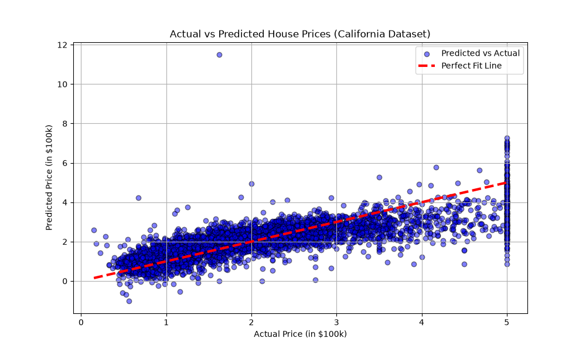

# House Price Prediction using Linear Regression

## 📌 Project Overview
This repository contains a Supervised Machine Learning minor project that predicts real estate values based on various socio-economic and structural features using the standard **California Housing Dataset**.

## 📊 Performance Metrics
The trained baseline Linear Regression model achieves the following evaluation results:
- **Mean Squared Error (MSE):** 0.5559
- **R-squared ($R^2$) Score:** 0.5758 (Approx. 57.6% variance explained)

## 📈 Visualizing Actual vs Predicted Prices
Here is the output visualization plot generated by the model during evaluation:

## 🛠️ Tech Stack & Libraries
- **Language:** Python 3.x
- **Libraries:** Pandas, NumPy, Scikit-Learn, Matplotlib, Seaborn
